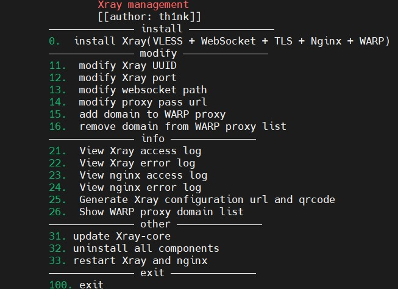

# Xray-script
> This is a shell script to install Xray and configure it
## Nginx + VLESS + WebSocket + WARP
 - **Nginx**: for reverse proxy
 - **WARP**: used to proxy custom requests
## Quick Start
 1. Buy a domain and a VPS.
 2. Add a DNS record pointing to your VPS server in your domain management panel(such as `v2.yourdomain.com`).
 3. Run the shell script.
    ```shell
    bash -c "$(curl -L https://raw.githubusercontent.com/th1nk-er/Xray-script/main/install.sh)"
    ```
    > Quick install: use `-d` to specify your domain
    >
    > You can also use `-p` to specify the port and `-P` to specify the proxy url
    ```shell
    bash -c "$(curl -L https://raw.githubusercontent.com/th1nk-er/Xray-script/main/install.sh)" -- -d v2.yourdomain.com
    ```
## Screenshot
